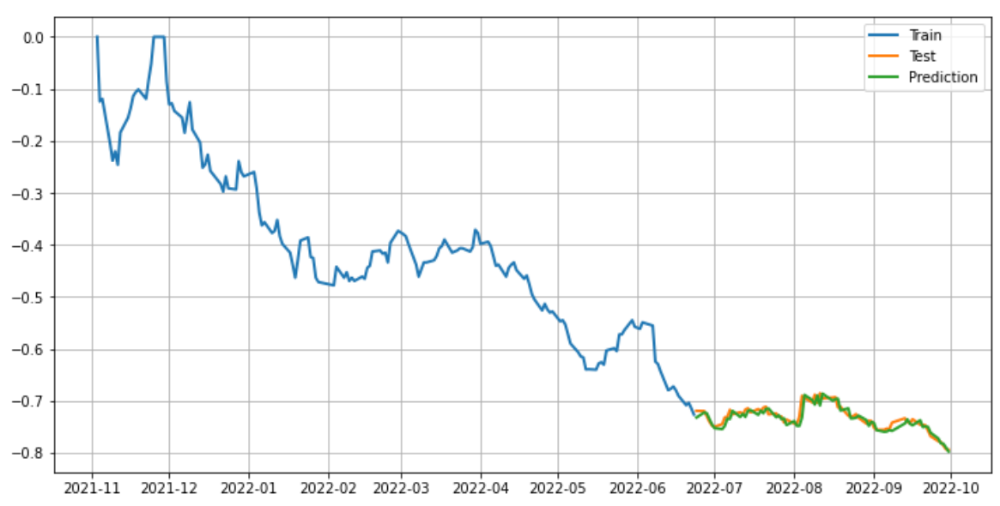
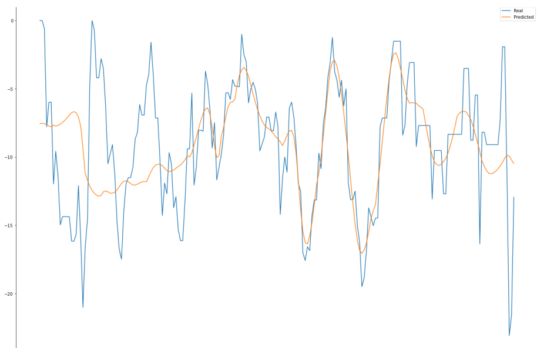

# 비상장 주식 MDD 예측 프로젝트
향후 1년간 특정 비상장 주식의 MDD를 예측하는 프로젝트
> MDD : "Maximum Drawdown"의 약자로, 주가의 최고 하락폭을 의미함

## 진행 기간
- 2022.09 ~ 2022.10

## 참여 인원 & 역할
- 총 3명
- 팀장, 기획부터 모델링까지 전체 총괄

## 사용 기술
### Language
- Python3
### Library
- FinanceDataReader
- talib
- numpy
- pandas
- matplotlib
- seaborn
- pmdarima
- pytorch

## 설명
- 스타트업과 연계하여 특정 비상장 주식의 주가와 경제, 기업, 기술 지표들을 결합하여 주가의 MDD(최고 하락폭)를 예측하는 프로젝트입니다.
- FinanceDataReader로 주가 데이터를 가져와 MDD로 변환하여 예측 대상으로 설정했습니다.
- 경제 지표는 한국은행 100대 경제지표와 국가통계포털의 경제지표들을 API를 통해 가져왔습니다.
- 기업 지표는 혁신의 숲 홈페이지를 통해 가져왔습니다.
- 기술적 지표는 주가 데이터를 talib로 변환하여 사용하였습니다.
- 불러온 각종 지표와 MDD간의 상관관계를 확인하여, MDD와 가장 관계가 높은 상위 20개의 지표를 추려냈습니다.
- 이후 ARIMA 모델과 LSTM 모델을 사용해 시계열 모델링 진행하여 MDD를 예측했습니다.

## 트러블 슈팅
- 일정 관리의 어려움
    - 스타트업에서 제공 받기로한 비상장 주식 데이터의 제공이 원활하지 못해 데이터 수집 부분에서 차질이 있었습니다.
    - 다행히 일정관리를 넉넉하게 해서 기한 내에 프로젝트를 마무리 했습니다.
- 비상장 주식 데이터 부족
    - 데이터 제공에서 차질이 생기면서, 비상장주식의 공개된 데이터로는 양이 부족하다고 판단하여 비상장주식에서 상장주식으로 변경, 상장 주식 중 하나를 골라 데이터를 직접 수집했습니다.
    - 대부분의 기업 지표 데이터는 1년에 한 번 정도밖에 나오지 않아, 혁신의 숲을 통해 짧은 주기의 지표들을 선정하여 가져왔습니다.

## 결과
### ARIMA

### LSTM

## 회고 / 느낀 점
- 팀 프로젝트를 통해 개인으로는 느낄 수 없던 협업시 커뮤니케이션의 중요성을 깨달았습니다.
- 프로젝트의 돌발 상황을 고려해 일정 관리를 넉넉하게 하였음에도 시간이 촉박했습니다. 이로 인해 좀 더 넉넉한 일정관리의 필요성을 깨달았습니다.
- 시계열 모델의 이해도가 아직 부족하고, 모델의 오버피팅이 의심돼 더 노력해야겠다고 다짐했습니다.
